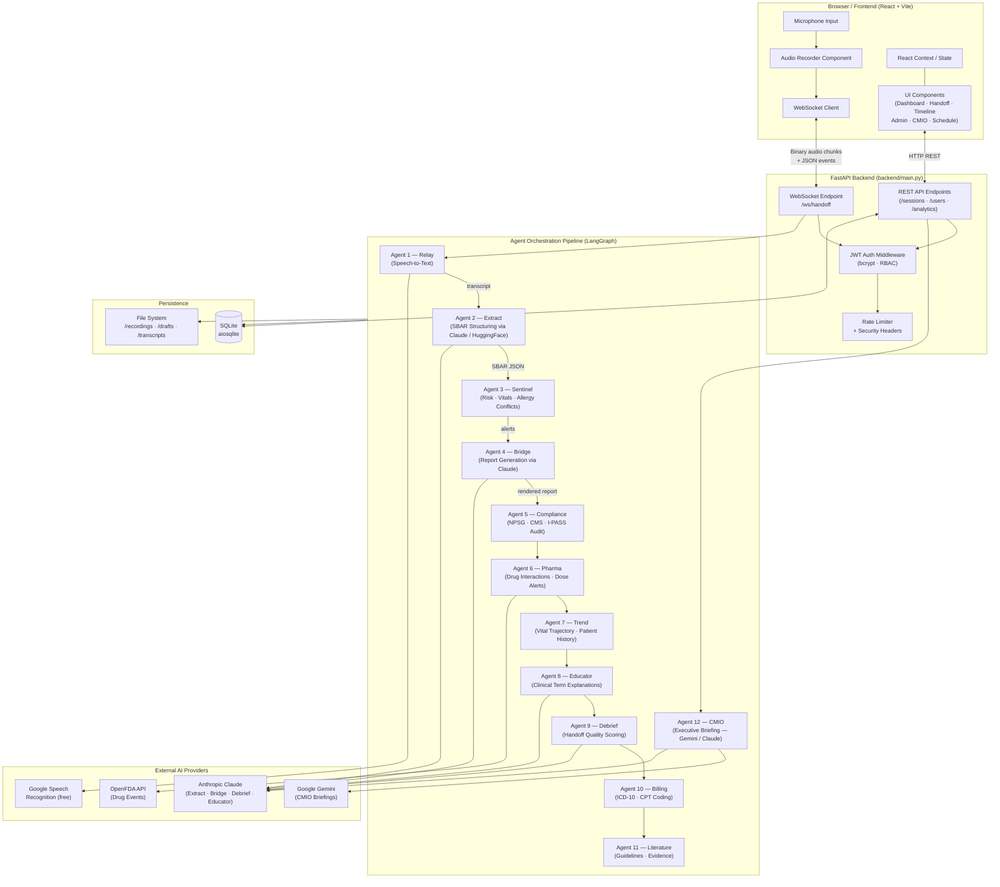

# MedRelay

> **AI-Powered Clinical Handoff & Intelligence Platform**

MedRelay modernizes nursing shift transitions by capturing verbal bedside handoffs, structuring them into standardized SBAR reports via a multi-agent AI pipeline, performing real-time risk and medication safety analysis, and delivering deep clinical analytics — all through a polished, glassmorphism-inspired React interface.

---

## Table of Contents

1. [Overview](#1-overview)
2. [System Architecture](#2-system-architecture)
3. [Backend](#3-backend)
   - [Entry Point & API Layer](#entry-point--api-layer)
   - [Authentication & Security](#authentication--security)
   - [Database Layer](#database-layer)
   - [Multi-Agent Pipeline](#multi-agent-pipeline)
4. [Agent Reference](#4-agent-reference)
5. [Frontend](#5-frontend)
6. [Tech Stack](#6-tech-stack)
7. [Quick Start](#7-quick-start)
8. [Configuration & Environment](#8-configuration--environment)
9. [Role-Based Access Control](#9-role-based-access-control)
10. [Directory Structure](#10-directory-structure)

---

## 1. Overview

### The Problem
Traditional nursing handoffs are verbal, unstructured, and error-prone. Critical patient information is lost, allergies are missed, and risk flags go unnoticed during shift changes.

### What MedRelay Does
| Capability | Description |
|---|---|
| **Voice Capture** | Browser-based audio recording of the bedside handoff conversation |
| **Auto-Transcription** | Real-time speech-to-text via Google Speech Recognition |
| **SBAR Structuring** | Claude AI (with HuggingFace fallback) extracts structured clinical data |
| **Risk Analysis** | Sentinel engine flags vital violations, allergy-drug conflicts, and missing documentation |
| **Medication Safety** | Pharma agent detects drug-drug interactions, dose alerts, and duplicate therapy |
| **Compliance Auditing** | Validates against Joint Commission NPSG and CMS standards |
| **Quality Scoring** | Debrief agent grades the handoff 0–100 with coaching feedback |
| **Trend Tracking** | Trend agent compares current vitals against historical sessions for the same patient |
| **Clinical Education** | Educator agent surfaces plain-language explanations of medical terms in the transcript |
| **Billing Assistance** | Billing agent suggests ICD-10 and CPT codes from clinical context |
| **Evidence Support** | Literature agent retrieves relevant clinical guidelines and research |
| **CMIO Briefings** | Executive-level AI-generated morning briefings powered by Gemini or Claude |

---

## 2. System Architecture

### High-Level Flow

```
Browser (Mic) ──► WebSocket ──► Relay Agent ──► Transcription
                                                     │
                                           Extract Agent (Claude/HF)
                                                     │
                                              Structured SBAR
                                           ┌──────────┴──────────┐
                                    Sentinel Agent         Compliance Agent
                                    (Risk Alerts)          (NPSG/CMS Audit)
                                           └──────────┬──────────┘
                                               Bridge Agent
                                           (Final Report Text)
                                                     │
                              ┌──────────────────────┼──────────────────────┐
                         Pharma Agent         Trend Agent            Debrief Agent
                      (Drug Safety)     (Vital Trajectory)       (Quality Score)
                              │                      │                      │
                         Educator Agent       Billing Agent        Literature Agent
                      (Clinical Terms)    (ICD-10 / CPT)       (Evidence/Guidelines)
                                                     │
                                           SQLite Database
                                                     │
                                         REST API ◄──┘──► React Frontend
```

### Architecture Diagram



---

## 3. Backend

### Entry Point & API Layer

**File:** `backend/main.py`

The FastAPI application is the single entry point for all backend traffic. On startup it initialises the SQLite database via `lifespan`. It exposes:

| Route | Method | Description |
|---|---|---|
| `/ws/handoff` | WebSocket | Full-duplex real-time pipeline; accepts binary audio chunks and control JSON messages |
| `/sessions` | GET | Paginated list of completed handoff sessions |
| `/sessions/{id}` | GET | Full detail of a single session including SBAR, alerts, and all agent reports |
| `/sessions/{id}` | DELETE | Remove a session record |
| `/analytics/overview` | GET | Census counts, acuity breakdown, compliance percentages |
| `/analytics/trends` | GET | Handoff volume and efficiency scores over time |
| `/analytics/risks` | GET | Risk alert frequency heatmap data |
| `/users` | GET/POST/PUT/DELETE | User management (admin only) |
| `/admin/cmio-briefing` | GET | Trigger a CMIO executive briefing |
| `/demo/run` | POST | Run the full pipeline against the built-in demo transcript |
| `/upload-recording` | POST | Upload a pre-recorded audio file for processing |
| `/export/sessions` | GET | Export sessions as an Excel workbook |

#### WebSocket Message Protocol

```
Client → Server (binary):   raw audio bytes (WebM/OGG/WAV/MP3)
Client → Server (JSON):     { "type": "start", "outgoing": "...", "incoming": "..." }
                            { "type": "stop" }
                            { "type": "partial" }

Server → Client (JSON):     { "type": "partial_transcript", "text": "..." }
                            { "type": "sbar", "data": { ... } }
                            { "type": "alerts", "data": [ ... ] }
                            { "type": "report", "data": { ... } }
                            { "type": "done", "session_id": "..." }
                            { "type": "error", "message": "..." }
```

---

### Authentication & Security

**Files:** `backend/auth.py`, `backend/middleware.py`, `backend/constants.py`

| Feature | Implementation |
|---|---|
| Password hashing | `bcrypt` via `passlib` |
| Tokens | JWT access token (short-lived) + refresh token (long-lived, HTTP-only cookie) |
| Account lockout | Tracks failed login attempts; locks account after threshold |
| Rate limiting | `auth_rate_limiter` (login) and `upload_rate_limiter` (file upload) |
| Security headers | `SecurityHeadersMiddleware` sets `X-Frame-Options`, `X-Content-Type-Options`, `Strict-Transport-Security`, CSP |
| Request logging | `RequestLoggingMiddleware` emits structured log lines for every request |
| WebSocket auth | `authenticate_ws_token` validates JWT from the query string on WS upgrade |

---

### Database Layer

**File:** `backend/database.py`

SQLite via `aiosqlite` — no infrastructure required. Tables:

| Table | Purpose |
|---|---|
| `users` | Credentials, roles, account-lock state |
| `sessions` | Completed handoff sessions (SBAR, alerts, all agent reports as JSON columns) |
| `audit_log` | Immutable log of sensitive actions (login, delete, export) |

Key functions: `init_db()`, `save_session()`, `get_session()`, `list_sessions()`, `get_history_for_trends()`.

---

### Multi-Agent Pipeline

**File:** `backend/pipeline.py`

Built on **LangGraph** as a directed acyclic graph. The pipeline is invoked once per handoff after the WebSocket `stop` signal is received.

```
START
  │
  ▼
relay_node  ──────────────────────── (Relay Agent: transcribe audio)
  │
  ▼
extract_node ─────────────────────── (Extract Agent: text → SBAR JSON)
  │
  ▼
sentinel_node ────────────────────── (Sentinel Agent: risk alerts)
  │
  ▼
bridge_node ──────────────────────── (Bridge Agent: render final report)
  │
  ▼
[parallel specialist nodes]
  ├─ compliance_node
  ├─ pharma_node
  ├─ trend_node
  ├─ educator_node
  ├─ debrief_node
  ├─ billing_node
  └─ literature_node
  │
  ▼
END  →  save to DB  →  stream result to WebSocket client
```

**Fallback strategy:** Every node that calls Claude catches API errors and falls back to deterministic heuristics or the built-in knowledge base. A full demo-mode is triggered when no transcript was captured.

---

## 4. Agent Reference

### Agent 1 — Relay Agent
**File:** `backend/agents/relay_agent.py`

Receives raw binary audio chunks over the WebSocket, accumulates them in a buffer, and transcribes them using Google's free Speech Recognition API (no key required). Supports WebM, OGG, MP3, WAV, and FLAC; non-WAV formats are auto-converted via `pydub` + `ffmpeg`. Two independent thread-pool executors handle partial (live) and final transcriptions to prevent starvation. `energy_threshold` and `dynamic_energy_threshold` are tuned for clinical environments.

---

### Agent 2 — Extract Agent
**File:** `backend/agents/extract_agent.py`

Converts the raw transcript into a fully structured `SBARData` JSON object by prompting **Claude** with a strict JSON schema. If Claude is unavailable (no API key, quota, network error), it lazy-loads a local **HuggingFace Flan-T5** model (`hf_extract_agent.py`) as a fallback. The output schema covers:

- `patient` — name, age, MRN, room
- `situation` — primary diagnosis, admission reason, current status
- `background` — PMH, medications, allergies, recent procedures
- `assessment` — vitals (BP, HR, RR, Temp, SpO2), labs pending, labs recent, neuro status, pain
- `recommendation` — care plan, escalation triggers, pending orders, action items
- `risk_score` — pre-computed score, level, contributing factors

---

### Agent 3 — Sentinel Agent
**File:** `backend/agents/sentinel_agent.py`

Deterministic rules-based risk engine. Checks:

| Check Type | Details |
|---|---|
| **Vital thresholds** | BP (systolic/diastolic), HR, RR, Temp, SpO2 with HIGH/MEDIUM borderline bands |
| **Allergy-drug conflicts** | Calls `fda_client.check_allergy_drug_conflict()` which queries OpenFDA; also does local keyword matching |
| **Missing documentation** | Checks for absent weight, allergies, escalation triggers, care plan, MRN |

Alerts are sorted HIGH → MEDIUM → LOW and each carries a `severity`, `category`, and `description`. Also computes a weighted 0–100 numeric risk score.

---

### Agent 4 — Bridge Agent
**File:** `backend/agents/bridge_agent.py`

Generates the **final human-readable SBAR report** using Claude. The output is a structured text document (not HTML) formatted for bedside tablet display with seven sections: Patient Banner, Situation, Background, Assessment, Recommendation, Risk Alerts, and Handoff Details. Falls back to a template-formatted string if Claude is unavailable.

---

### Agent 5 — Compliance Agent
**File:** `backend/agents/compliance_agent.py`

Audits the completed SBAR against:

| Standard | Requirement |
|---|---|
| NPSG.01.01.01 | Two patient identifiers present |
| NPSG.03.06.01 | Current medications documented |
| NPSG.03.06.02 | Known allergies documented |
| NPSG.02.05.01 | Current status/condition included |
| CMS-COPs | Care plan and responsible clinician documented |
| I-PASS Best Practice | Escalation triggers and handoff receiver identified |

Produces a `ComplianceReport` with a gap list (CRITICAL/MAJOR/MINOR), an overall compliance score (0–100), and a pass/fail flag.

---

### Agent 6 — Pharma Agent
**File:** `backend/agents/pharma_agent.py`

Advanced medication safety analysis beyond simple allergy checks. Uses a built-in ICU/hospital drug interaction knowledge base plus optional OpenFDA adverse-event queries.

| Analysis Type | Examples |
|---|---|
| **Drug-drug interactions** | Anticoagulant + NSAID, ACE inhibitor + K-sparing diuretic, QT-prolonging agent combos |
| **Dose range validation** | Checks against standard therapeutic ranges for common ICU drugs |
| **Duplicate therapy detection** | Flags two drugs from the same class |
| **Dose adjustment flags** | Renal and hepatic impairment markers |
| **High-alert medications** | Insulin, heparin, concentrated electrolytes, narcotics |

Produces a `PharmaReport` with `DrugInteraction` and `DoseAlert` lists, each with severity and recommended action.

---

### Agent 7 — Trend Agent
**File:** `backend/agents/trend_agent.py`

Queries the database for all prior sessions matching the current patient's MRN or name, then compares vital signs across time to determine trajectory: **Improving / Stable / Worsening**. When no history exists it runs a lightweight heuristic predictive model. Returns a `TrendReport` with per-vital `VitalTrend` objects and an overall deterioration risk flag.

---

### Agent 8 — Educator Agent
**File:** `backend/agents/educator_agent.py`

Scans the transcript for medical terminology and generates plain-language explanations for each term found. Uses Claude for rich, contextual explanations; falls back to a built-in ICU/hospital terminology dictionary (~30+ terms) when Claude is unavailable. Covers terms like `sepsis`, `vasopressor`, `MAP`, `lactate`, `procalcitonin`, `central line`, `intubation`, `rapid response`, `DNR`, and more. Returns a `EducatorReport` with `ClinicalTip` entries.

---

### Agent 9 — Debrief Agent
**File:** `backend/agents/debrief_agent.py`

Evaluates the quality of the handoff communication for Quality Improvement (QI) programs. Uses a deterministic scoring rubric for consistency, with optional Claude-generated personalised coaching notes.

| Scoring Dimension | Max Points |
|---|---|
| SBAR completeness | 40 pts |
| Clarity and specificity | 20 pts |
| Critical information coverage | 20 pts |
| Time efficiency | 10 pts |
| Actionable language | 10 pts |

Returns a `DebriefReport` with a `HandoffScorecard`, strengths, improvement areas, and coaching feedback.

---

### Agent 10 — Billing Agent
**File:** `backend/agents/billing_agent.py`

Analyses the structured SBAR to suggest appropriate medical billing codes, supporting revenue integrity and documentation completeness.

| Code Type | Examples |
|---|---|
| **ICD-10 Diagnosis** | A41.9 (Sepsis), R65.21 (Septic shock), J18.9 (Pneumonia), E11.9 (T2DM) |
| **CPT Procedure** | Critical care time codes, central line placement, invasive monitoring |
| **Complexity level** | LOW / MODERATE / HIGH based on acuity |

Returns a `BillingReport` with `CodeSuggestion` entries each carrying a confidence score.

---

### Agent 11 — Literature Agent
**File:** `backend/agents/literature_agent.py`

Simulates a Clinical Decision Support (CDS) system by retrieving condition-relevant clinical guidelines and research. Matches the primary diagnosis against a curated evidence database and returns `EvidenceResource` records with title, source, URL, summary, and relevance score. Covers sepsis bundles, cardiac protocols, respiratory guidelines, and more.

---

### Agent 12 — CMIO Agent
**File:** `backend/agents/cmio_agent.py`

Aggregates system-wide session data to produce executive-level **Morning Briefings** for the Chief Medical Information Officer (or charge nurse / supervisor). Uses **Google Gemini** as primary AI provider with **Claude** as fallback. The briefing includes:

- Patient census summary and acuity breakdown
- Top recurring risk categories across all handoffs
- Compliance performance metrics
- Staffing alerts and workload flags
- Suggested focus areas for the shift

---

## 5. Frontend

**Directory:** `frontend/src/`

Built with **React 19 + Vite**. All pages use a glassmorphism design system (frosted glass cards, dark gradient backgrounds, subtle borders).

### Components

| Component | Route / Usage | Description |
|---|---|---|
| `LoginPage.jsx` | `/login` | JWT-authenticated login form with account lockout feedback |
| `Dashboard.jsx` | `/dashboard` | Analytics overview: census, acuity, compliance, risk heatmap, efficiency trends |
| `HandoffSession.jsx` | `/handoff` | Main recording workflow — start/stop recording, live transcript, SBAR preview, final report display |
| `LiveTranscript.jsx` | Inside HandoffSession | Real-time partial transcript panel updated over WebSocket |
| `PatientTimeline.jsx` | `/timeline` | Chronological view of all handoff sessions for a patient with vital trend charts |
| `CMIOBriefing.jsx` | `/cmio` | CMIO executive briefing panel; triggers the CMIO agent and renders the structured briefing |
| `NurseSchedule.jsx` | `/schedule` | Shift scheduling view populated from the staffing seed data |
| `AdminPanel.jsx` | `/admin` | User management (create, edit, delete), role assignment, audit log viewer |

### State Management

| Context / Hook | Purpose |
|---|---|
| `AuthContext` | Stores JWT, current user object, role; provides `login()`, `logout()` |
| `WebSocket` (`api/websocket.js`) | Manages WebSocket lifecycle — connect, reconnect, message routing, binary audio send |

### Build

```powershell
# Development
npm run dev        # Vite dev server on http://localhost:5173

# Production
npm run build      # Outputs to frontend/dist/
npm run preview    # Preview production build locally
```

---

## 6. Tech Stack

### Backend
| Layer | Technology |
|---|---|
| Web framework | FastAPI 0.115+ (Python 3.11+) |
| Async runtime | `asyncio` + `uvicorn` |
| WebSockets | FastAPI native WebSocket |
| Database | SQLite via `aiosqlite` |
| Auth | `python-jose` (JWT) + `passlib[bcrypt]` |
| AI orchestration | LangGraph (directed graph pipeline) |
| Primary AI | Anthropic Claude (`claude-3-5-haiku` / configurable) |
| CMIO AI | Google Gemini (`gemini-flash-latest`) |
| Fallback AI | HuggingFace `google/flan-t5-base` (local, no API key) |
| Speech-to-text | `SpeechRecognition` + Google Speech API (free tier) |
| Audio conversion | `pydub` + `imageio-ffmpeg` (WebM → WAV) |
| Drug data | OpenFDA REST API |
| Excel export | `openpyxl` |

### Frontend
| Layer | Technology |
|---|---|
| Framework | React 19 |
| Build tool | Vite 6 |
| Styling | Tailwind CSS v4 + custom CSS variables |
| Design system | Glassmorphism (backdrop-filter, gradients) |
| State | React Context API |
| HTTP / WS | Native `fetch` + `WebSocket` browser APIs |
| Icons | Lucide React |

---

## 7. Quick Start

### Prerequisites
- Python 3.11+
- Node.js 18+
- `ffmpeg` on PATH (for WebM audio conversion — [install guide](https://ffmpeg.org/download.html))

### 1. Clone & Configure

```powershell
git clone <repo-url>
cd MedRelay
```

Copy and fill in your API keys:

```powershell
copy .env.example .env
# Edit .env with your keys (see Section 8)
```

### 2. Backend Setup

```powershell
# Create and activate virtual environment
python -m venv .venv
.\.venv\Scripts\Activate.ps1

# Install dependencies
pip install -r backend/requirements.txt

# Start the API server (hot reload)
python -m uvicorn backend.main:app --reload --port 8000
```

### 3. Frontend Setup

```powershell
cd frontend
npm install
npm run dev
```

### 4. Access

| Service | URL |
|---|---|
| Web App | http://localhost:5173 |
| API (Swagger) | http://localhost:8000/docs |
| API (ReDoc) | http://localhost:8000/redoc |

### 5. Seed Demo Data (Optional)

```powershell
# Seed shift scheduling data
python scripts/seed_scheduling.py

# Generate analytics feed from CSV
python scripts/generate_feed_excel.py
```

---

## 🔐 Admin & Security
Default Credentials (Demo Mode):
- **User**: `admin`
- **Pass**: `1234`

**Role-Based Access Control (RBAC):**
- **Admin**: Full system access, analytics, user management.
- **Supervisor**: Analytics view, audit logs.
- **Nurse**: Handoff creation, history view.

---

## 📈 Analytics Dashboard
access the new dashboard at `/dashboard` (Admin role required).
1.  **Overview**: Real-time census, acuity breakdown, compliance stats.
2.  **Trends**: Efficiency scores and handoff volume analysis.
3.  **Quality**: Automated scoring of handoff fidelity and completeness.
4.  **Risk**: Heatmap visualization of frequent clinical alerts.

---

## 🤝 Contribution
1.  Fork the repository.
2.  Create a feature branch (`git checkout -b feature/AmazingFeature`).
3.  Commit changes (`git commit -m 'Add AmazingFeature'`).
4.  Push to branch (`git push origin feature/AmazingFeature`).
5.  Open a Pull Request.

---

**MedRelay** — *Streamlining Care, One Handoff at a Time.*
