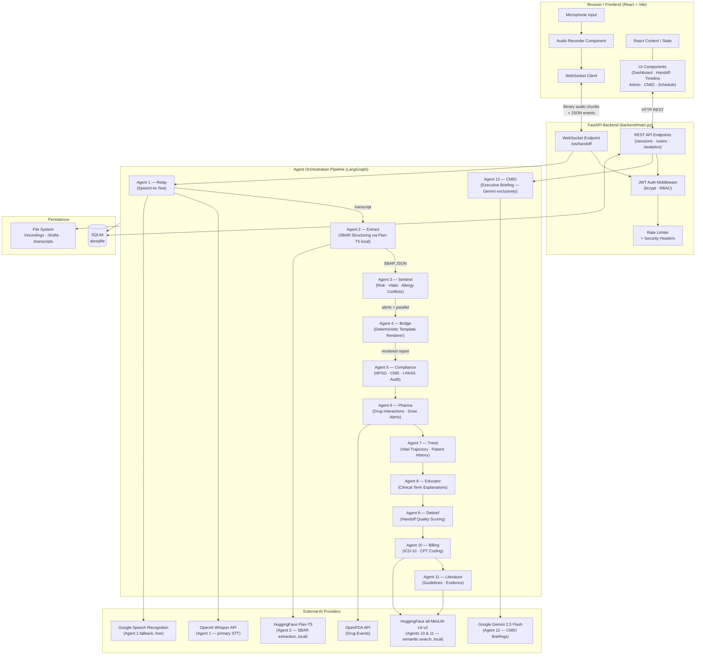

# MedRelay

> **AI-Powered Clinical Handoff & Intelligence Platform**

MedRelay modernizes nursing shift transitions by capturing verbal bedside handoffs, structuring them into standardized SBAR reports via a multi-agent AI pipeline, performing real-time risk and medication safety analysis, and delivering deep clinical analytics — all through a polished, glassmorphism-inspired React interface.

---

## Table of Contents

1. [Overview](#1-overview)
2. [System Architecture](#2-system-architecture)
3. [Backend](#3-backend)
   - [Entry Point & API Layer](#entry-point--api-layer)
   - [Authentication & Security](#authentication--security)
   - [Database Layer](#database-layer)
   - [Multi-Agent Pipeline](#multi-agent-pipeline)
4. [Agent Reference](#4-agent-reference)
5. [Frontend](#5-frontend)
6. [Tech Stack](#6-tech-stack)
7. [Quick Start](#7-quick-start)
8. [Configuration & Environment](#8-configuration--environment)
9. [Role-Based Access Control](#9-role-based-access-control)
10. [Directory Structure](#10-directory-structure)
11. [Medical Data Sources & Clinical Knowledge Bases](#11-medical-data-sources--clinical-knowledge-bases)

---

## 1. Overview

### The Problem
Traditional nursing handoffs are verbal, unstructured, and error-prone. Critical patient information is lost, allergies are missed, and risk flags go unnoticed during shift changes.

### What MedRelay Does
| Capability | Description |
|---|---|
| **Voice Capture** | Browser-based audio recording of the bedside handoff conversation |
| **Auto-Transcription** | OpenAI Whisper API (cloud, primary) with Google Speech Recognition as fallback |
| **SBAR Structuring** | HuggingFace Flan-T5 (local, no API key) extracts structured clinical data |
| **Risk Analysis** | Sentinel engine flags vital violations, allergy-drug conflicts, and missing documentation |
| **Medication Safety** | Pharma agent detects drug-drug interactions, dose alerts, and duplicate therapy |
| **Compliance Auditing** | Validates against Joint Commission NPSG and CMS standards |
| **Quality Scoring** | Debrief agent grades the handoff 0–100 with deterministic coaching feedback |
| **Trend Tracking** | Trend agent compares current vitals against historical sessions for the same patient |
| **Clinical Education** | Educator agent surfaces plain-language explanations from a built-in ICU terminology KB |
| **Billing Assistance** | Semantic ICD-10/CPT matching via sentence-transformers (all-MiniLM-L6-v2) |
| **Evidence Support** | Semantic guideline retrieval via sentence-transformers (all-MiniLM-L6-v2) |
| **CMIO Briefings** | Executive-level AI-generated morning briefings powered exclusively by Google Gemini |

---

## 2. System Architecture

### High-Level Flow

```
Browser (Mic) ──► WebSocket ──► Relay Agent ──► Whisper API (OpenAI)
                                                     │  (fallback: Google STT)
                                           Extract Agent (Flan-T5, local)
                                                     │
                                              Structured SBAR
                                                     │
                                           Sentinel Agent
                                           (Risk Alerts)
                                                     │
                              ┌──────────────────────┼──────────────────────┐
                       Compliance Agent      Pharma Agent          Trend Agent
                       (NPSG/CMS)           (Drug Safety)      (Vital Trajectory)
                              │                      │                      │
                       Educator Agent       Billing Agent        Literature Agent
                     (Terminology KB)  (all-MiniLM-L6-v2)   (all-MiniLM-L6-v2)
                              │                      │                      │
                       Debrief Agent         [ parallel asyncio.gather ]   │
                      (Quality Score)                │                      │
                                               Bridge Agent
                                          (Deterministic Template)
                                                     │
                                           SQLite Database
                                                     │
                                         REST API ◄──┘──► React Frontend
```

### Architecture Diagram



---

## 3. Backend

### Entry Point & API Layer

**File:** `backend/main.py`

The FastAPI application is the single entry point for all backend traffic. On startup it initialises the SQLite database via `lifespan`. It exposes:

| Route | Method | Description |
|---|---|---|
| `/ws/handoff` | WebSocket | Full-duplex real-time pipeline; accepts binary audio chunks and control JSON messages |
| `/sessions` | GET | Paginated list of completed handoff sessions |
| `/sessions/{id}` | GET | Full detail of a single session including SBAR, alerts, and all agent reports |
| `/sessions/{id}` | DELETE | Remove a session record |
| `/analytics/overview` | GET | Census counts, acuity breakdown, compliance percentages |
| `/analytics/trends` | GET | Handoff volume and efficiency scores over time |
| `/analytics/risks` | GET | Risk alert frequency heatmap data |
| `/users` | GET/POST/PUT/DELETE | User management (admin only) |
| `/admin/cmio-briefing` | GET | Trigger a CMIO executive briefing |
| `/demo/run` | POST | Run the full pipeline against the built-in demo transcript |
| `/upload-recording` | POST | Upload a pre-recorded audio file for processing |
| `/export/sessions` | GET | Export sessions as an Excel workbook |

#### WebSocket Message Protocol

```
Client → Server (binary):   raw audio bytes (WebM/OGG/WAV/MP3)
Client → Server (JSON):     { "type": "start", "outgoing": "...", "incoming": "..." }
                            { "type": "stop" }
                            { "type": "partial" }

Server → Client (JSON):     { "type": "partial_transcript", "text": "..." }
                            { "type": "sbar", "data": { ... } }
                            { "type": "alerts", "data": [ ... ] }
                            { "type": "report", "data": { ... } }
                            { "type": "done", "session_id": "..." }
                            { "type": "error", "message": "..." }
```

---

### Authentication & Security

**Files:** `backend/auth.py`, `backend/middleware.py`, `backend/constants.py`

| Feature | Implementation |
|---|---|
| Password hashing | `bcrypt` via `passlib` |
| Tokens | JWT access token (short-lived) + refresh token (long-lived, HTTP-only cookie) |
| Account lockout | Tracks failed login attempts; locks account after threshold |
| Rate limiting | `auth_rate_limiter` (login) and `upload_rate_limiter` (file upload) |
| Security headers | `SecurityHeadersMiddleware` sets `X-Frame-Options`, `X-Content-Type-Options`, `Strict-Transport-Security`, CSP |
| Request logging | `RequestLoggingMiddleware` — lightweight console log for all requests |
| **HIPAA audit log** | **`RequestLoggingMiddleware` writes a JSON audit record to `logs/audit.log` for every PHI-adjacent endpoint (`/api/sessions`, `/api/finalise`, `/api/sign`, `/admin`, `/ws/handoff`)** |
| **Audit record fields** | **UTC timestamp · request UUID · user ID (from JWT) · action · status · latency · IP hash (SHA-256) · session ref hash · outcome** |
| WebSocket auth | `authenticate_ws_token` validates JWT from the query string on WS upgrade |

---

### Database Layer

**File:** `backend/database.py`

SQLite via `aiosqlite` — no infrastructure required. Tables:

| Table | Purpose |
|---|---|
| `users` | Credentials, roles, account-lock state |
| `sessions` | Completed handoff sessions (SBAR, alerts, all agent reports as JSON columns) |
| `audit_log` | Immutable DB log of sensitive actions (login, delete, export) |

Key functions: `init_db()`, `save_session()`, `get_session()`, `list_sessions()`, `get_history_for_trends()`.

> **HIPAA audit trail:** In addition to the DB `audit_log` table, every PHI-adjacent API call is also written as a newline-delimited JSON record to `logs/audit.log` (append-only flat file). IP addresses and session IDs are SHA-256 hashed before logging. The `logs/` directory is excluded from version control. Retain for ≥ 6 years per HIPAA §164.530(j).

---

### Trust & Compliance Controls

**File:** `backend/models.py`, `backend/middleware.py`

Every AI-generated report carries two machine-readable trust fields automatically populated on every response:

#### Clinical Safety Disclaimer

All report models (`PharmaReport`, `BillingReport`, `LiteratureReport`, `FinalReport`) include a `disclaimer` field:

```
MedRelay outputs are clinical decision support only and do not constitute medical advice.
All treatment, medication, and care decisions remain the sole responsibility of the
licensed clinician. Always verify AI-generated information against primary clinical
sources before acting.
```

This supports FDA SaMD advisory-only classification (21st Century Cures Act) and is required by most hospital procurement processes.

#### Knowledge Base Version Metadata

Every report stamps the exact dataset versions used, enabling audit traceability for regulatory review (FDA, HIPAA, HITRUST):

| Key | Version String |
|---|---|
| `drug_interactions` | ISMP-2023 / FDA-Labeling / NICE-CG182 / MHRA-DSU |
| `high_alert_meds` | ISMP-Acute-Care-2023 |
| `dose_limits` | FDA-Labeling / ASHP-IDSA-2020 / AHA-HF-2022 |
| `allergy_classes` | FDA-Labeling / IDSA-2021 / Macy-Romano-JACI-2014 |
| `vital_thresholds` | SSC-2021 / NEWS2 / BTS-O2 / ACLS |
| `icd10_codes` | ICD-10-CM-FY2024 (CMS) |
| `cpt_codes` | AMA-CPT-2024 |
| `clinical_guidelines` | SSC-2021 / KDIGO-2012 / AHA-ACC-HF-2022 / AHA-ACC-ACS-2023 / AHA-ASA-Stroke-2019 / GOLD-2025 / ESC-PE-2019 / ADA-2024 / ERS-ATS-ARDS-2023 |
| `compliance_standards` | TJC-NPSG-2024 / CMS-CoP-482 |

---

### Multi-Agent Pipeline

**File:** `backend/pipeline.py`

Built on **LangGraph** as a directed acyclic graph. The pipeline is invoked once per handoff after the WebSocket `stop` signal is received.

```
START
  │
  ▼
transcribe ────────────────────────── (Relay Agent: Whisper API → Google STT fallback)
  │
  ▼                   ┌─ (empty transcript) ─────────────────────────┐
extract ──────────────┤                                               │
  │                   └─ (has transcript) ──────────────────────────▼│
  ▼                                                           bridge_node
sentinel ─────────────────────────── (Sentinel Agent: risk alerts)   ↑
  │                                                                   │
  ▼                                                                   │
parallel_agents ──── asyncio.gather ─────────────────────────────────┘
  ├─ compliance
  ├─ pharma
  ├─ trend
  ├─ educator
  ├─ debrief
  ├─ billing
  └─ literature
  │
  ▼
bridge ─────────────────────────────── (Template renderer: deterministic)
  │
  ▼
END  →  save to DB  →  stream result to WebSocket client
```

**Execution model:** After `extract` completes, all 7 specialist agents (`compliance`, `pharma`, `trend`, `educator`, `debrief`, `billing`, `literature`) run in **true parallel** via `asyncio.gather`, dramatically reducing end-to-end pipeline latency. A conditional edge skips the full pipeline when no transcript is available and jumps directly to the bridge node. Per-node timing is tracked in `HandoffState.node_timings` for observability. A full demo-mode is triggered when no live transcript was captured.

---

## 4. Agent Reference

### Agent 1 — Relay Agent
**File:** `backend/agents/relay_agent.py`

Receives raw binary audio chunks over the WebSocket, accumulates them in a buffer, and transcribes them in two stages:

1. **Primary — OpenAI Whisper API** (`whisper-1`): Sends the accumulated audio bytes directly to the cloud Whisper endpoint. Requires `OPENAI_API_KEY` in `.env`. Provides significantly higher accuracy for clinical speech with medical terminology.
2. **Fallback — Google Speech Recognition** (free, no key): Used automatically when Whisper API is unavailable or the key is not set.

Supports WebM, OGG, MP3, WAV, and FLAC; non-WAV formats are auto-converted via `pydub` + `ffmpeg`. Two independent thread-pool executors handle partial (live) and final transcriptions to prevent starvation.

---

### Agent 2 — Extract Agent
**File:** `backend/agents/extract_agent.py`

Converts the raw transcript into a fully structured `SBARData` JSON object using a local **HuggingFace Flan-T5** model (`google/flan-t5-base` via `hf_extract_agent.py`). No external API key required — the model is downloaded once and cached locally (~900 MB). Uses multiple focused QA-style prompts that Flan-T5 excels at, extracting each SBAR field independently.

Output schema covers:

- `patient` — name, age, MRN, room
- `situation` — primary diagnosis, admission reason, current status
- `background` — PMH, medications, allergies, recent procedures
- `assessment` — vitals (BP, HR, RR, Temp, SpO2), labs pending, labs recent, neuro status, pain
- `recommendation` — care plan, escalation triggers, pending orders, action items
- `risk_score` — pre-computed score, level, contributing factors

---

### Agent 3 — Sentinel Agent
**File:** `backend/agents/sentinel_agent.py`

Deterministic rules-based risk engine. Checks:

| Check Type | Details |
|---|---|
| **Vital thresholds** | BP (SBP + DBP + computed MAP), HR, RR, Temp, SpO2 with HIGH/MEDIUM borderline bands |
| **MAP computation** | Parses diastolic BP and calculates MAP; HIGH alert if MAP < 65 mmHg (SSC 2021), MEDIUM if 65–70 mmHg, HIGH if DBP < 40 mmHg |
| **Allergy-drug conflicts** | Calls `fda_client.check_allergy_drug_conflict()` — penicillin, cephalosporin, sulfonamide class checks + cross-reactivity detection |
| **Missing documentation** | Checks for absent weight, allergies, escalation triggers, care plan, MRN |

Alerts are sorted HIGH → MEDIUM → LOW and each carries a `severity`, `category`, and `description`. Also computes a weighted 0–100 numeric risk score.

---

### Agent 4 — Bridge Agent
**File:** `backend/agents/bridge_agent.py`

Generates the **final human-readable SBAR report** using a deterministic template renderer — no API key required. The output is a structured text document (not HTML) formatted for bedside tablet display with eight sections: Patient Banner, Situation, Background, Assessment (full vitals + labs), Recommendation (care plan + action items), Risk Alerts (with HIGH/MEDIUM/LOW markers), Risk Score, and Handoff Details. Runs instantly with zero latency.

---

### Agent 5 — Compliance Agent
**File:** `backend/agents/compliance_agent.py`

Audits the completed SBAR against:

| Standard | Requirement |
|---|---|
| NPSG.01.01.01 | Two patient identifiers present |
| NPSG.03.06.01 | Current medications documented |
| NPSG.03.06.02 | Known allergies documented |
| NPSG.02.05.01 | Current status/condition included |
| CMS-COPs | Care plan and responsible clinician documented |
| I-PASS Best Practice | Escalation triggers and handoff receiver identified |

Produces a `ComplianceReport` with a gap list (CRITICAL/MAJOR/MINOR), an overall compliance score (0–100), and a pass/fail flag.

---

### Agent 6 — Pharma Agent
**File:** `backend/agents/pharma_agent.py`

Advanced medication safety analysis beyond simple allergy checks. Uses a built-in ICU/hospital drug interaction knowledge base plus optional OpenFDA adverse-event queries.

| Analysis Type | Examples |
|---|---|
| **Drug-drug interactions** | 15 verified pairs: anticoagulant+NSAID, ACEi+K-sparing diuretic, QT-prolonging combos, warfarin+azoles, methotrexate+NSAIDs (FDA Black Box), calcineurin inhibitor+azole (CYP3A4), lithium+thiazides (MHRA), warfarin+macrolides, and more |
| **Dose range validation** | 13 drugs with FDA/ASHP/AHA-sourced maximum daily doses and clinical notes |
| **Duplicate therapy detection** | Flags two drugs from the same class |
| **Dose adjustment flags** | Renal and hepatic impairment markers |
| **High-alert medications** | 40+ agents across 9 ISMP categories (2023 update) |

Produces a `PharmaReport` with `DrugInteraction` and `DoseAlert` lists, each with severity and recommended action.

---

### Agent 7 — Trend Agent
**File:** `backend/agents/trend_agent.py`

Queries the database for all prior sessions matching the current patient's MRN or name, then compares vital signs across time to determine trajectory: **Improving / Stable / Worsening**. When no history exists it runs a lightweight heuristic predictive model. Returns a `TrendReport` with per-vital `VitalTrend` objects and an overall deterioration risk flag.

---

### Agent 8 — Educator Agent
**File:** `backend/agents/educator_agent.py`

Scans the transcript for medical terminology and generates plain-language explanations for each term found using a built-in ICU/hospital terminology dictionary (30+ terms). No external API required. Covers terms like `sepsis`, `vasopressor`, `MAP`, `lactate`, `procalcitonin`, `central line`, `intubation`, `rapid response`, `DNR`, and more. Also surfaces condition-specific evidence-based care tips (sepsis, pneumonia, heart failure, diabetes, stroke) and relevant clinical protocols. Returns an `EducatorReport` with `ClinicalTip` entries.

---

### Agent 9 — Debrief Agent
**File:** `backend/agents/debrief_agent.py`

Evaluates the quality of the handoff communication for Quality Improvement (QI) programs. Uses a fully deterministic scoring rubric for consistency. No external API required.

| Scoring Dimension | Max Points |
|---|---|
| SBAR completeness | 10 pts |
| Clarity and specificity | 10 pts |
| Patient safety | 10 pts |
| SBAR structure adherence | 10 pts |
| Time efficiency | 10 pts |

Total is normalised to 0–100 with letter grade A–F. Coaching notes are generated deterministically from the weakest scoring dimension.

Returns a `DebriefReport` with a `HandoffScorecard`, strengths, improvement areas, and coaching feedback.

---

### Agent 10 — Billing Agent
**File:** `backend/agents/billing_agent.py`

Analyses the structured SBAR to suggest appropriate medical billing codes, supporting revenue integrity and documentation completeness. Uses **semantic similarity** (HuggingFace `sentence-transformers/all-MiniLM-L6-v2`) to match the clinical context against an ICD-10 code pool — no keyword matching required.

| Code Type | Examples |
|---|---|
| **ICD-10 Diagnosis** | 38-entry pool: A41.9 (Sepsis), R65.21 (Septic shock), N17.9 (AKI), J96.01 (Resp Failure), I50.9 (Heart Failure), I63.9 (Stroke), I21.9 (MI), J44.1 (COPD exac.), I26.99 (PE), I48.91 (A-fib) and more |
| **CPT Procedure** | 8 codes: critical care (99291), central line (36556), arterial line (36620), intubation (31500), CRRT (90945), chest tube (32551), foley (51702), bronchoscopy (31622), LP (62270) |
| **Complexity level** | LOW / MODERATE / HIGH — complexity-stratified billing tips for each level |

Returns a `BillingReport` with `CodeSuggestion` entries each carrying a confidence score (cosine similarity threshold 0.38).

---

### Agent 11 — Literature Agent
**File:** `backend/agents/literature_agent.py`

Simulates a Clinical Decision Support (CDS) system by retrieving condition-relevant clinical guidelines and research. Matches the primary diagnosis against a curated evidence database and returns `EvidenceResource` records with title, source, URL, summary, and relevance score.

Uses **semantic similarity** (HuggingFace `sentence-transformers/all-MiniLM-L6-v2`) to match the clinical context against a curated evidence database — cosine similarity threshold 0.30. No internet or API key required after model download.

**12 guidelines embedded** across: Sepsis (SSC 2021, EGDT NEJM), Pneumonia (ATS/IDSA 2019), ARDS (ARDSNet + ERS/ATS/ESICM 2023 Berlin update), AKI (KDIGO 2012), Heart Failure (AHA/ACC 2022), ACS/MI (AHA/ACC 2023), Stroke (AHA/ASA 2019), COPD (GOLD 2025), PE (ESC 2019), DKA (ADA Standards 2024).

---

### Agent 12 — CMIO Agent
**File:** `backend/agents/cmio_agent.py`

Aggregates system-wide session data to produce executive-level **Morning Briefings** for the Chief Medical Information Officer (or charge nurse / supervisor). Uses **Google Gemini 2.5 Flash** exclusively (`GEMINI_API_KEY` required). Falls back to a deterministic rule-based summary when Gemini is unavailable — no Claude dependency. The briefing includes:

- Patient census summary and acuity breakdown
- Top recurring risk categories across all handoffs
- Compliance performance metrics
- Staffing alerts and workload flags
- Suggested focus areas for the shift

---

## 5. Frontend

**Directory:** `frontend/src/`

Built with **React 19 + Vite**. All pages use a glassmorphism design system (frosted glass cards, dark gradient backgrounds, subtle borders).

### Components

| Component | Route / Usage | Description |
|---|---|---|
| `LoginPage.jsx` | `/login` | JWT-authenticated login form with account lockout feedback |
| `Dashboard.jsx` | `/dashboard` | Analytics overview: census, acuity, compliance, risk heatmap, efficiency trends |
| `HandoffSession.jsx` | `/handoff` | Main recording workflow — start/stop recording, live transcript, SBAR preview, final report display |
| `LiveTranscript.jsx` | Inside HandoffSession | Real-time partial transcript panel updated over WebSocket |
| `PatientTimeline.jsx` | `/timeline` | Chronological view of all handoff sessions for a patient with vital trend charts |
| `CMIOBriefing.jsx` | `/cmio` | CMIO executive briefing panel; triggers the CMIO agent and renders the structured briefing |
| `NurseSchedule.jsx` | `/schedule` | Shift scheduling view populated from the staffing seed data |
| `AdminPanel.jsx` | `/admin` | User management (create, edit, delete), role assignment, audit log viewer |

### State Management

| Context / Hook | Purpose |
|---|---|
| `AuthContext` | Stores JWT, current user object, role; provides `login()`, `logout()` |
| `WebSocket` (`api/websocket.js`) | Manages WebSocket lifecycle — connect, reconnect, message routing, binary audio send |

### Build

```powershell
# Development
npm run dev        # Vite dev server on http://localhost:5173

# Production
npm run build      # Outputs to frontend/dist/
npm run preview    # Preview production build locally
```

---

## 6. Tech Stack

### Backend
| Layer | Technology |
|---|---|
| Web framework | FastAPI 0.115+ (Python 3.11+) |
| Async runtime | `asyncio` + `uvicorn` |
| WebSockets | FastAPI native WebSocket |
| Database | SQLite via `aiosqlite` |
| Auth | `python-jose` (JWT) + `passlib[bcrypt]` |
| AI orchestration | LangGraph (directed graph, parallel `asyncio.gather`) |
| Transcription (primary) | OpenAI Whisper API (`whisper-1`) |
| Transcription (fallback) | `SpeechRecognition` + Google Speech API (free tier) |
| SBAR extraction | HuggingFace `google/flan-t5-base` (local, ~900 MB download once) |
| Semantic search (billing / literature) | HuggingFace `sentence-transformers/all-MiniLM-L6-v2` (local) |
| CMIO briefings | Google Gemini 2.5 Flash (`gemini-2.5-flash`) |
| Audio conversion | `pydub` + `imageio-ffmpeg` (WebM → WAV) |
| Drug data | OpenFDA REST API |
| Excel export | `openpyxl` |

### Frontend
| Layer | Technology |
|---|---|
| Framework | React 19 |
| Build tool | Vite 6 |
| Styling | Tailwind CSS v4 + custom CSS variables |
| Design system | Glassmorphism (backdrop-filter, gradients) |
| State | React Context API |
| HTTP / WS | Native `fetch` + `WebSocket` browser APIs |
| Icons | Lucide React |

---

## 7. Quick Start

### Prerequisites
- Python 3.11+
- Node.js 18+
- `ffmpeg` on PATH (for WebM audio conversion — [install guide](https://ffmpeg.org/download.html))

### 1. Clone & Configure

```powershell
git clone <repo-url>
cd MedRelay
```

Copy and fill in your API keys:

```powershell
copy .env.example .env
# Edit .env with your keys (see Section 8)
```

### 2. Backend Setup

```powershell
# Create and activate virtual environment
python -m venv .venv
.\.venv\Scripts\Activate.ps1

# Install dependencies
pip install -r backend/requirements.txt

# Start the API server (hot reload)
python -m uvicorn backend.main:app --reload --port 8000
```

### 3. Frontend Setup

```powershell
cd frontend
npm install
npm run dev
```

### 4. Access

| Service | URL |
|---|---|
| Web App | http://localhost:5173 |
| API (Swagger) | http://localhost:8000/docs |
| API (ReDoc) | http://localhost:8000/redoc |

### 5. Seed Demo Data (Optional)

```powershell
# Seed shift scheduling data
python scripts/seed_scheduling.py

# Generate analytics feed from CSV
python scripts/generate_feed_excel.py
```

---

## 8. Configuration & Environment

Create a `.env` file in the project root:

```env
# AI Providers
OPENAI_API_KEY=sk-proj-...         # Whisper API for transcription (Agent 1 primary)
GEMINI_API_KEY=AIza...             # Gemini 2.5 Flash for CMIO Briefings (Agent 12)

# JWT
MEDRELAY_JWT_SECRET=your-secret-key-here
MEDRELAY_ACCESS_TOKEN_MINUTES=30
MEDRELAY_REFRESH_TOKEN_DAYS=7

# Account lockout
MEDRELAY_MAX_LOGIN_ATTEMPTS=5
MEDRELAY_LOCKOUT_MINUTES=15

# CORS
MEDRELAY_ALLOWED_ORIGINS=http://localhost:5173,http://localhost:3000
```

> **No keys? No problem.** All agents run locally via HuggingFace models (Flan-T5, all-MiniLM-L6-v2) or deterministic logic — no Claude or Anthropic dependency anywhere. If `OPENAI_API_KEY` is not set, transcription falls back to Google's free Speech Recognition tier. If `GEMINI_API_KEY` is not set, the CMIO briefing uses a deterministic rule-based summary. The system runs a complete demo pipeline with rich hardcoded data when no live transcript is available.

---

## 9. Role-Based Access Control

| Role | Permissions |
|---|---|
| **Admin** | Full access: user management, analytics, export, audit log, CMIO briefing, all handoff operations |
| **Supervisor** | Analytics view, audit log, read-only session history, handoff creation, export |
| **Charge Nurse** | Analytics view, session history, handoff creation, export |
| **Nurse** | Create and view own handoff sessions only |

Default demo credentials:

```
Username: admin
Password: 1234
```

Account lockout activates after 5 consecutive failed login attempts. Locked accounts display a countdown timer. Lockout duration: 15 minutes (configurable via `MEDRELAY_LOCKOUT_MINUTES`).

---

## 10. Directory Structure

```
MedRelay/
├── backend/
│   ├── main.py               # FastAPI app, all REST + WebSocket routes
│   ├── pipeline.py           # LangGraph agent orchestration
│   ├── models.py             # Pydantic models — SBAR, reports, CLINICAL_DISCLAIMER, _KB_VERSIONS
│   ├── database.py           # SQLite async DB helpers
│   ├── auth.py               # JWT, bcrypt, RBAC helpers
│   ├── config.py             # Environment config, vital thresholds
│   ├── constants.py          # Roles, permissions, demo transcript
│   ├── middleware.py         # Security headers, rate limiting, HIPAA audit logger
│   ├── audio_storage.py      # Recording file persistence helpers
│   ├── fda_client.py         # OpenFDA API client
│   └── agents/
│       ├── relay_agent.py    # Agent 1  — Speech-to-text
│       ├── extract_agent.py  # Agent 2  — SBAR extraction (HuggingFace Flan-T5)
│       ├── sentinel_agent.py # Agent 3  — Risk & vital alerts
│       ├── bridge_agent.py   # Agent 4  — Report generation
│       ├── compliance_agent.py # Agent 5 — NPSG/CMS audit
│       ├── pharma_agent.py   # Agent 6  — Drug safety analysis
│       ├── trend_agent.py    # Agent 7  — Vital trajectory
│       ├── educator_agent.py # Agent 8  — Clinical education
│       ├── debrief_agent.py  # Agent 9  — Handoff quality scoring
│       ├── billing_agent.py  # Agent 10 — ICD-10 / CPT coding
│       ├── literature_agent.py # Agent 11 — Evidence / guidelines
│       ├── cmio_agent.py     # Agent 12 — Executive briefings
│       ├── staffing_agent.py # Staffing analytics — rule-based auto-reassignment
│       ├── hf_extract_agent.py # HuggingFace Flan-T5 SBAR extraction (primary engine)
│       ├── hf_billing_agent.py # HuggingFace all-MiniLM-L6-v2 ICD-10 semantic matching
│       └── hf_literature_agent.py # HuggingFace all-MiniLM-L6-v2 guideline semantic search
├── frontend/
│   ├── src/
│   │   ├── App.jsx           # Router, auth guard
│   │   ├── components/       # All page and feature components
│   │   ├── api/websocket.js  # WebSocket client wrapper
│   │   └── contexts/         # AuthContext and other React contexts
│   ├── index.html
│   ├── vite.config.js
│   └── package.json
├── recordings/
│   ├── transcripts/          # Saved transcript text files
│   ├── metadata/             # Session metadata JSON files
│   └── drafts/               # In-progress draft transcripts
├── demo/
│   ├── sample_patient.json   # Demo patient data
│   └── medrelay_feed_data.csv # Analytics seed data
├── scripts/
│   ├── seed_scheduling.py    # Populates shift schedule demo data
│   └── generate_feed_excel.py # Generates Excel analytics feed
└── .env                      # API keys and config (not committed)
```

---

## 11. Medical Data Sources & Clinical Knowledge Bases

MedRelay embeds verified, authoritative clinical data directly in the agent layer. No internet connection is required for the core safety checks — all knowledge bases are compiled from published guidelines and regulatory standards.

---

### 11.1 Vital Sign Thresholds

**Source:** Standard critical care and early warning score (EWS) reference ranges used across ICU/ED settings.

| Parameter | Alert Threshold | Severity | Clinical Reference |
|---|---|---|---|
| Heart Rate | < 50 bpm | HIGH (Bradycardia) | ACLS / EWS Guidelines |
| Heart Rate | > 120 bpm | HIGH (Tachycardia) | ACLS / EWS Guidelines |
| Heart Rate | 108–120 bpm | MEDIUM (Borderline) | ±10% borderline band |
| Systolic BP | < 90 mmHg | HIGH (Hypotension) | Surviving Sepsis Campaign 2021 |
| Systolic BP | > 180 mmHg | HIGH (Hypertension) | JNC-8 / AHA 2017 |
| Systolic BP | 90–99 mmHg | MEDIUM (Borderline) | ±10% borderline band |
| **MAP** | **< 65 mmHg** | **HIGH (Septic Shock target)** | **Surviving Sepsis Campaign 2021** |
| MAP | 65–70 mmHg | MEDIUM (Borderline) | SSC 2021 vasopressor target |
| Diastolic BP | < 40 mmHg | HIGH (Vascular Collapse) | Critical Care standard |
| SpO2 | < 92% | HIGH (Hypoxia) | BTS Oxygen Guidelines |
| SpO2 | 92–94% | MEDIUM (Borderline) | BTS Oxygen Guidelines |
| Respiratory Rate | < 10 /min | HIGH (Bradypnoea) | NEWS2 Score |
| Respiratory Rate | > 30 /min | HIGH (Tachypnoea) | NEWS2 Score |
| Temperature | < 36.0°C | MEDIUM (Hypothermia) | SIRS Criteria / SSC 2021 |
| Temperature | > 38.5°C | HIGH (Fever) | SIRS Criteria / SSC 2021 |

**MAP computation:** The sentinel agent now parses both systolic and diastolic components of the BP string and computes **MAP = (SBP + 2 × DBP) / 3** in real time, generating independent HIGH/MEDIUM alerts versus the SSC 2021 vasopressor target of ≥ 65 mmHg.

**SIRS Criteria detection:** HR > 90 bpm AND RR > 20 /min simultaneously triggers an automatic +15-point escalation to the risk score.

---

### 11.2 Drug–Drug Interaction Knowledge Base

**Source:** Compiled from FDA drug labeling, ISMP (Institute for Safe Medication Practices), and standard clinical pharmacology references (Micromedex equivalents).

**File:** `backend/agents/pharma_agent.py` → `_INTERACTION_DB`

| Interaction Pair | Severity | Clinical Risk | Source |
|---|---|---|---|
| Anticoagulant + NSAID | SEVERE | Significantly elevated bleeding risk | FDA Labeling / ISMP |
| ACE inhibitor + K-sparing diuretic | SEVERE | Life-threatening hyperkalemia | FDA Labeling |
| Dual QT-prolonging agents (amiodarone/sotalol + azithromycin/fluoroquinolone/haloperidol/ondansetron) | SEVERE | Torsades de Pointes | FDA Labeling / CredibleMeds |
| SSRI + tramadol/fentanyl/meperidine/linezolid | SEVERE | Serotonin syndrome | FDA Black Box Warning |
| Aminoglycoside + loop diuretic | MODERATE | Additive ototoxicity and nephrotoxicity | ASHP Drug Info |
| Metformin + iodinated contrast | MODERATE | Lactic acidosis risk | FDA Labeling |
| Digoxin + amiodarone/CCB | SEVERE | Digoxin toxicity (level doubled) | FDA Labeling |
| Opioid + benzodiazepine | CONTRAINDICATED | Respiratory depression and death | FDA Black Box Warning |
| Vasopressor + MAO inhibitor | CONTRAINDICATED | Severe hypertensive crisis | FDA Labeling / Lexicomp |
| **Warfarin + azoles/metronidazole** | **SEVERE** | **INR elevated 50–100% (CYP2C9 inhibition)** | **FDA Labeling** |
| **ACEi/ARB + NSAID (Triple Whammy)** | **SEVERE** | **Acute kidney injury** | **NICE CG182 / Lancet 1994** |
| **Methotrexate + NSAIDs** | **CONTRAINDICATED** | **Myelosuppression, renal failure, GI ulceration** | **FDA Black Box Warning** |
| **Calcineurin inhibitor + azole** | **SEVERE** | **Drug levels elevated 3–5× → nephrotoxicity** | **FDA Labeling (CYP3A4)** |
| **Lithium + NSAIDs/thiazides** | **SEVERE** | **Lithium toxicity (reduced renal clearance)** | **FDA / MHRA Drug Safety Update** |
| **Warfarin + macrolide antibiotics** | **SEVERE** | **INR elevated 15–30% (CYP3A4/CYP2C9)** | **FDA Labeling** |

---

### 11.3 High-Alert Medications (ISMP List)

**Source:** [ISMP List of High-Alert Medications in Acute Care Settings](https://www.ismp.org/recommendations/high-alert-medications-acute-list)

The following medications trigger an automatic `⚠ ISMP High-Alert Medication` flag with an independent double-check recommendation:

| Category | Medications (ISMP 2023) |
|---|---|
| Anticoagulants | heparin, warfarin, enoxaparin, fondaparinux, apixaban, rivaroxaban, dabigatran |
| Opioids | morphine, fentanyl, hydromorphone, methadone, oxycodone, hydrocodone, meperidine |
| Vasoactives / Inotropes | epinephrine, norepinephrine, vasopressin, dopamine, dobutamine, phenylephrine, milrinone |
| Concentrated electrolytes | potassium chloride, potassium phosphate, magnesium sulfate, hypertonic saline, concentrated sodium chloride, concentrated dextrose |
| Insulin | all insulin formulations |
| Neuromuscular blocking agents | rocuronium, succinylcholine, cisatracurium, vecuronium, pancuronium |
| Antiarrhythmics | amiodarone, digoxin |
| Thrombolytics (tPA) | alteplase, tenecteplase, reteplase |
| Antineoplastics | methotrexate, cytarabine, vincristine, cyclophosphamide, bleomycin |
| High-risk ICU agents | nitroprusside, propofol, ketamine, dexmedetomidine, tacrolimus, cyclosporine |

---

### 11.4 Duplicate Therapy Detection — Drug Classes

**Source:** Standard therapeutic classification (ATC system / clinical pharmacology).

| Drug Class | Detected Agents |
|---|---|
| NSAID | ibuprofen, naproxen, ketorolac, toradol, celecoxib, diclofenac, indomethacin |
| ACE Inhibitor | lisinopril, enalapril, ramipril, captopril, benazepril, quinapril |
| ARB | losartan, valsartan, irbesartan, candesartan, olmesartan |
| Statin | atorvastatin, rosuvastatin, simvastatin, pravastatin, lovastatin |
| PPI | omeprazole, pantoprazole, lansoprazole, esomeprazole, rabeprazole |
| Opioid | morphine, oxycodone, hydromorphone, fentanyl, hydrocodone, methadone, tramadol |
| Benzodiazepine | midazolam, lorazepam, diazepam, alprazolam, clonazepam |
| Vasopressor | norepinephrine, vasopressin, epinephrine, dopamine, dobutamine, phenylephrine |

---

### 11.5 Dose Range Reference Table

**Source:** Standard drug references (clinical pharmacology / prescribing information).

| Drug | Maximum Daily Dose | Unit | Notes |
|---|---|---|---|
| Vancomycin | 4,000 mg | mg/day | Adjust for renal function; TDM required — ASHP/IDSA/SIDP 2020 |
| Metformin | 2,550 mg | mg/day | Hold with contrast or eGFR < 30 — FDA Labeling |
| Acetaminophen | 4,000 mg | mg/day | 3,000 mg/day in hepatic impairment — FDA Labeling |
| Ibuprofen | 3,200 mg | mg/day | Use lowest effective dose — FDA Labeling |
| Lisinopril | 80 mg | mg/day | Titrate per BP response — FDA Labeling |
| Furosemide | 600 mg | mg/day | Monitor electrolytes and renal function — FDA Labeling |
| Morphine (oral) | 200 mg | mg/day | IV thresholds differ; individualize |
| Amiodarone | 1,200 mg | mg (loading) | Maintenance 200–400 mg/day — FDA Labeling |
| **Digoxin** | **0.25 mg** | **mg/day** | **Maintenance 0.125–0.25 mg/day; narrow TI — FDA / AHA HF Guidelines** |
| **Phenytoin** | **300 mg** | **mg/day** | **Typical maintenance; monitor drug levels — FDA Labeling** |
| **Prednisone** | **80 mg** | **mg/day** | **Most indications; taper for chronic use — Clinical Practice** |
| **Dexamethasone** | **40 mg** | **mg/day** | **High-dose pulse; usual < 16 mg/day — FDA Labeling** |
| **Gabapentin** | **3,600 mg** | **mg/day** | **Reduce dose for eGFR < 60 — FDA Labeling** |

---

### 11.6 Allergy–Drug Conflict Detection

**Source:** FDA drug labeling + clinical pharmacology (penicillin cross-reactivity data).

**File:** `backend/fda_client.py`

| Mechanism | Coverage | Source |
|---|---|---|
| **Penicillin class allergy** | 17 agents: penicillin, amoxicillin, ampicillin, piperacillin, piperacillin-tazobactam, nafcillin, oxacillin, dicloxacillin, cloxacillin, augmentin, flucloxacillin, ticarcillin, co-amoxiclav, temocillin, benzylpenicillin, phenoxymethylpenicillin, pivampicillin | FDA Labeling / IDSA |
| **Cephalosporin class allergy** | 14 agents: cephalexin, cefazolin, cefuroxime, ceftriaxone, ceftazidime, cefepime, cefdinir, cefprozil, cefadroxil, cefotaxime, cefoxitin, cefpodoxime, ceftolozane, loracarbef | FDA Labeling / Merck Manual |
| **Sulfonamide class allergy** | 10 agents: sulfamethoxazole, trimethoprim, co-trimoxazole (Bactrim), Septra, sulfadiazine, sulfisoxazole, sulfadoxine, dapsone, sulfasalazine | FDA Labeling / IDSA |
| **Penicillin → Cephalosporin cross-reactivity** | ~2% cross-reactivity risk flagged with MEDIUM-HIGH alert | Macy & Romano (2014) JACI 133(2); IDSA Allergy Guidelines 2021 |
| **Generic keyword matching** | Cross-references every allergy term against every medication name using token matching (min 3-char base token) | — |
| **Live FDA reinforcement** | Queries `https://api.fda.gov/drug/event.json` for adverse event signal data for each prescribed drug | OpenFDA |

All allergy conflicts generate `HIGH` severity `RiskAlert` entries surfaced immediately in the report.

---

### 11.7 Regulatory Compliance Standards

**Source:** The Joint Commission National Patient Safety Goals (NPSG) 2024 and CMS Conditions of Participation (CoP).

**File:** `backend/agents/compliance_agent.py` → `_CHECKLIST`

| Standard ID | Requirement | Severity | Regulatory Body |
|---|---|---|---|
| NPSG.01.01.01 | Two patient identifiers (name + MRN or DOB) | CRITICAL | The Joint Commission |
| NPSG.03.06.01 | Current medications documented with dose, route, frequency | CRITICAL | The Joint Commission |
| NPSG.03.06.02 | Known allergies and reactions documented | CRITICAL | The Joint Commission |
| NPSG.02.05.01 | Patient current condition/status included | MAJOR | The Joint Commission |
| NPSG.ESCALATION | Escalation triggers and rapid-response criteria defined | MAJOR | The Joint Commission |
| NPSG.09.02.01 | Fall risk assessed and communicated | MAJOR | The Joint Commission |
| NPSG.07.01.01 | Infection control / isolation precautions documented | MINOR | The Joint Commission |
| CMS.482.43(d) | Active plan of care documented | MAJOR | CMS CoP |
| CMS.482.13(a) | Code status / advance directives documented | MAJOR | CMS CoP |
| CMS.482.24(c) | Primary diagnosis / reason for admission stated | MAJOR | CMS CoP |
| CMS.482.23(c) | Pending orders or scheduled follow-ups communicated | MINOR | CMS CoP |
| CMS.VITALS | Recent vital signs included in handoff | MAJOR | CMS CoP |
| CMS.LABS | Pending or recent lab results communicated | MINOR | CMS CoP |
| FACILITY.LOC | Patient room and bed number documented | MINOR | Facility Standard |

Compliance score = (standards met ÷ 14) × 100. Results of CRITICAL gaps block sign-off in production configurations.

---

### 11.8 Evidence-Based Clinical Guidelines (Literature Agent)

**Source:** Peer-reviewed publications and authoritative clinical societies.

**File:** `backend/agents/literature_agent.py`

| Guideline / Study | Source | Condition | Year |
|---|---|---|---|
| Surviving Sepsis Campaign: International Guidelines | SCCM / ESICM | Sepsis / Septic Shock | 2021 |
| Early Goal-Directed Therapy in Severe Sepsis | NEJM | Sepsis | 2001 |
| ATS/IDSA Guidelines for Community-Acquired Pneumonia | Am J Respir Crit Care Med | Pneumonia | 2019 |
| ARDSNet Low Tidal Volume Ventilation Protocol | ARDSNet | ARDS / Hypoxia | 2008 |
| **ERS/ATS/ESICM/SCCM Berlin Definition & Guidelines for ARDS** | **Eur Respir J** | **ARDS / Hypoxia** | **2023** |
| **KDIGO Clinical Practice Guideline for Acute Kidney Injury** | **KDIGO / Kidney Int Suppl** | **AKI / Renal Failure** | **2012** |
| **AHA/ACC/HFSA Guideline for the Management of Heart Failure** | **J Am Coll Cardiol** | **Heart Failure** | **2022** |
| **AHA/ACC Guideline for Diagnosis and Management of Acute Coronary Syndromes** | **J Am Coll Cardiol** | **ACS / MI** | **2023** |
| **AHA/ASA Guidelines for Early Management of Acute Ischaemic Stroke** | **Stroke** | **Stroke / CVA** | **2019** |
| **GOLD Global Strategy for COPD Prevention, Diagnosis and Management** | **GOLD Initiative** | **COPD** | **2025** |
| **ESC Guidelines on Diagnosis and Management of Acute Pulmonary Embolism** | **Eur Heart J** | **Pulmonary Embolism** | **2019** |
| **ADA Standards of Medical Care in Diabetes — DKA & HHS Management** | **Diabetes Care (ADA)** | **DKA / Hyperglycaemia** | **2024** |

---

### 11.9 Clinical Terminology Dictionary

**Source:** Clinical definitions compiled from standard nursing and critical care references (AACN, Mosby, UpToDate-equivalent definitions).

**File:** `backend/agents/educator_agent.py` → `_TERMINOLOGY`

The system recognizes and provides plain-language definitions for **30+ ICU/hospital terms** including:

| Term | Definition Source |
|---|---|
| sepsis, septic shock | SSC 2021 / Sepsis-3 definitions (Singer et al., JAMA 2016) |
| vasopressor, norepinephrine, MAP | Critical care pharmacology |
| lactate, procalcitonin | Biomarker interpretation guidelines |
| SBAR, rapid response | ISQua / IHI communication frameworks |
| central line, arterial line | Procedural nursing references |
| intubation, DNR, code status | ACLS / Advance Directive standards |
| vancomycin, piperacillin-tazobactam | Drug labeling / ISMP |
| anaphylaxis | NIAID / WAO anaphylaxis guidelines |
| tachycardia, bradycardia, hypotension | AHA / EWS references |
| hypoxia, tachypnoea, hypothermia | NEWS2 / BTS references |
| MRSA, isolation precautions | CDC / APIC infection control |
| fall risk | Morse Fall Scale (Morse, 1989) |

---

### 11.10 Condition-Specific Care Tips

**Source:** Published clinical practice guidelines from major professional societies.

| Condition | Guideline Referenced | Source |
|---|---|---|
| Sepsis — Hour-1 Bundle | Surviving Sepsis Campaign 2021 + CMS SEP-1 | SCCM / ESICM / CMS |
| Sepsis — Lactate-Guided Resuscitation | SSC 2021 / CMS SEP-1 | SCCM / CMS |
| Pneumonia — Antibiotic Timing | ATS/IDSA 2019 CAP Guidelines | ATS / IDSA |
| Pneumonia — Sputum Culture | ATS/IDSA 2016 HAP/VAP Guidelines | ATS / IDSA |
| Heart Failure — Daily Weights | AHA/ACC 2022 HF Guidelines | AHA / ACC |
| Heart Failure — I&O Monitoring | AHA 2022 HF Guidelines | AHA |
| Diabetes — Insulin Safety | ISMP High-Alert Medication Guidelines | ISMP |
| Diabetes — Hypoglycemia Protocol | ADA Standards of Care 2024 | ADA |
| Stroke — NIH Stroke Scale | AHA/ASA 2019 Stroke Guidelines | AHA / ASA |

---

### 11.11 Clinical Protocol Library

**Source:** Standard hospital clinical protocols referenced for completeness in the Educator Agent.

| Trigger | Protocols Surfaced |
|---|---|
| sepsis | Sepsis Hour-1 Bundle (SSC 2021), Early Goal-Directed Therapy Protocol, Vasopressor Titration Protocol |
| pneumonia | CAP/HAP Antibiotic Selection Algorithm, Sputum Sample Collection Protocol |
| fall | Morse Fall Scale Assessment, Fall Prevention Bundle, Post-Fall Assessment Protocol |
| pain | Numeric Pain Scale Assessment, Multimodal Analgesia Protocol, Opioid Stewardship Guidelines |
| code | Code Blue Response Protocol, ACLS Algorithm, Rapid Response Activation Criteria |
| diabetes | Insulin Sliding Scale Protocol, Hypoglycemia Treatment Protocol, DKA Management Protocol |
| stroke | Acute Stroke Protocol, tPA Administration Checklist, Post-tPA Monitoring Protocol |
| cardiac | Chest Pain Protocol, Troponin Trending Protocol, Anticoagulation Protocol |
| respiratory | Oxygen Therapy Titration Protocol, Non-Invasive Ventilation Protocol, Intubation Checklist |
| renal | AKI KDIGO Staging Protocol, Renal Replacement Therapy Protocol, Contrast-Induced Nephropathy Prevention |

---

### 11.12 ICD-10 Diagnosis Codes

**Source:** [ICD-10-CM Official Guidelines for Coding and Reporting (FY2025)](https://www.cms.gov/medicare/coding-billing/icd-10-codes)

The Billing Agent maps clinical text to validated ICD-10-CM codes with a confidence score:

**Source:** ICD-10-CM Official Guidelines for Coding and Reporting FY2024 — [CMS](https://www.cms.gov/medicare/coding-billing/icd-10-codes)

| ICD-10 Code | Description | Confidence |
|---|---|---|
| A41.9 | Sepsis, unspecified organism | 0.95 |
| R65.21 | Severe sepsis with septic shock | 0.98 |
| J18.9 | Pneumonia, unspecified organism | 0.90 |
| E11.9 | Type 2 diabetes mellitus without complications | 0.85 |
| I10 | Essential (primary) hypertension | 0.90 |
| **N17.9** | **Acute kidney failure, unspecified** | **0.92** |
| **J96.01** | **Acute respiratory failure with hypoxia** | **0.95** |
| **I50.9** | **Heart failure, unspecified** | **0.88** |
| **I63.9** | **Cerebral infarction, unspecified (Stroke)** | **0.90** |
| **I21.9** | **Acute myocardial infarction, unspecified** | **0.93** |
| **J44.1** | **COPD with acute exacerbation** | **0.88** |
| **N39.0** | **Urinary tract infection, site not specified** | **0.87** |
| **I82.409** | **Acute DVT of unspecified deep veins of lower extremity** | **0.90** |
| **I26.99** | **Other pulmonary embolism without acute cor pulmonale** | **0.90** |
| **K92.1** | **Melena (GI haemorrhage)** | **0.88** |
| **I48.91** | **Unspecified atrial fibrillation** | **0.90** |
| **N18.9** | **Chronic kidney disease, unspecified stage** | **0.82** |
| **F10.20** | **Alcohol dependence, uncomplicated** | **0.80** |

---

### 11.13 SBAR Communication Framework

**Source:** Originally developed by the U.S. Navy; adopted in healthcare by the Institute for Healthcare Improvement (IHI) and standardized via the Joint Commission NPSG.02.05.01.

MedRelay's SBAR schema is structured as follows:

| Component | Fields Captured |
|---|---|
| **S — Situation** | Primary diagnosis, reason for admission, current clinical status |
| **B — Background** | Relevant medical history, current medications, allergies, recent procedures |
| **A — Assessment** | Vital signs (BP/HR/RR/Temp/SpO2), recent labs, pending labs, pain level, neuro status |
| **R — Recommendation** | Care plan, escalation triggers, pending orders, action items, next steps |

Additional structured fields: risk score (0–100), risk level (LOW/MODERATE/HIGH/CRITICAL), contributing factors.

---

*MedRelay — Streamlining Care, One Handoff at a Time.*
